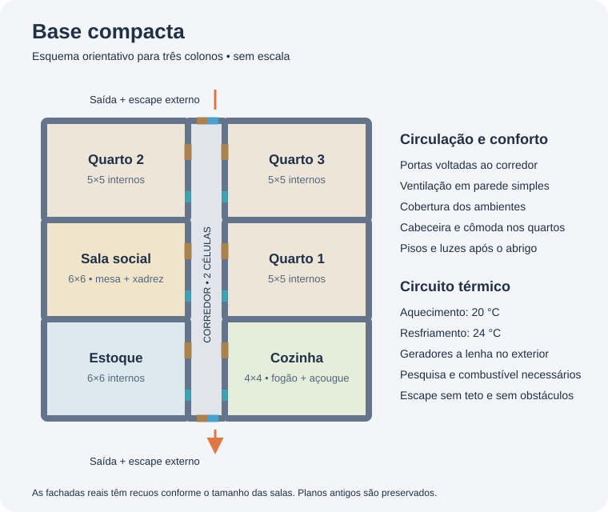
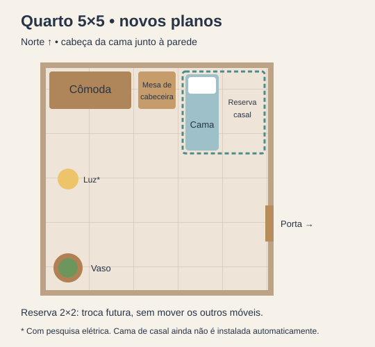

# Base compacta, conforto e clima

Implementação inicial de 5 de outubro de 2026, com execução revisada em 6 de outubro. Os novos planos usam um bloco com corredor central coberto de duas células, portas dos quartos voltadas para ele e duas saídas externas. Quartos têm 5×5 células internas; cozinha 4×4; estoque, freezer pesquisado e sala social 6×6. O planejador procura o bloco inteiro; se ele não cabe, procura salas independentes, preservando zonas, estruturas e itens proibidos. Trabalhadores podem transportar itens permitidos para fora do caminho pelas tarefas normais do jogo, sem destruí-los.

Exemplo anterior para três colonos, sem freezer (esquema de setores, não escala; a posição e o número de setores variam no plano atual):



```text
           saída norte / calor para o exterior
       ┌─────────────┬──┬─────────────┐
       │ quarto 2    │  │ quarto 3    │
       ├─────────────┤  ├─────────────┤
       │ sala social │  │ quarto 1     │
       ├─────────────┤  ├─────────────┤
       │ estoque     │  │ cozinha │
       └─────────────┴──┴─────────────┘
                     saída sul
         corredor: 2 células de largura
```

As salas são adicionadas em pares; tamanhos diferentes deixam recuos nas fachadas. Um novo bloco é reservado para expansão quando necessário. Projetos antigos permanecem no local original. O mod não demole a base para impor o novo estilo.

## Ordem construída nesta versão

1. Estoque seco protegido, com acesso livre na porta.
2. Quartos, camas e cobertura.
3. Cozinha com fogão a lenha, bancada de açougue e assento de trabalho; sala social com mesa, assentos e xadrez.
4. Corredor fechado, cobertura, saídas e, quando disponíveis, ventiladores e resfriadores.
5. Geração, cabos, aquecedores e luzes dos cômodos.
6. Mesa de cabeceira, cômoda e vaso por quarto.
7. Pisos uniformes nos ambientes e no corredor.

A ordem acima descreve as dependências do plano original. O executor atual financia lotes pequenos e mantém até três projetos ativos, até seis blueprints novos por ciclo e dezoito pendentes. O estoque funciona antes das paredes; energia pode avançar independentemente dos quartos. Consulte [execução, recuperação e testes normais](EXECUCAO-CONSTRUCAO.md) para as regras atuais. Trabalhadores reais executam as tarefas; o mod não cria prédios instantaneamente. Hostis interrompem novas ordens. Cancelamentos ou mudanças manuais pausam o módulo afetado; desligar a base remove os projetos pendentes da IA e mantém estruturas e obras que já receberam materiais.

## Estilo e felicidade

- Um conjunto uniforme de materiais, corredores livres e móveis alinhados dá uma aparência organizada sem aumentar excessivamente a área.
- Paredes de pedra são preferidas quando há blocos suficientes para o conjunto. Portas e móveis começam em madeira. Pisos de pedra, preferencialmente mármore, são escolhidos quando há pesquisa e estoque suficiente; o plano reserva os blocos das paredes antes dos pisos. O fallback é madeira, que é inflamável.
- Mesa de cabeceira e cômoda são colocadas para se conectarem às camas; não adianta acumular várias do mesmo tipo junto à mesma cama. O teste consulta as conexões reais das instalações de conforto.
- A sala social reúne refeição e recreação, economizando deslocamentos e permitindo desenvolver um ambiente mais impressionante. A qualidade dos móveis depende de quem os constrói.
- Pisos eliminam o solo exposto e facilitam manter o ambiente limpo. Não tornam a cozinha estéril e não substituem o trabalho de limpeza. Vasos usam o plantio nativo de lírios, dependendo de cultivo, luz e temperatura. Arte e pintura continuam pendentes.
- Não há bônus de humor garantido por um tamanho fixo: impressividade, beleza, limpeza, espaço, qualidade, necessidades e preferências dos colonos continuam sendo calculados pelo jogo.

**Evitar:** entulho e cadáveres nos ambientes, animais sujando a cozinha, móveis bloqueando portas/interações, pisos caros antes de comida e abrigo, madeira como material definitivo em locais de alto risco de incêndio e gastar toda a reserva em decoração.

A cozinha continua com açougue junto, como solicitado. Isso concentra trabalho sujo no ambiente de preparo. Uma melhoria futura recomendada é um anexo separado para açougue, com acesso curto e sem passagem pela bancada de cozinha.

## Quarto conforme o exemplo

Nos novos quartos a cabeça da cama fica contra a parede norte. A cômoda ocupa as duas primeiras células dessa parede, a mesa de cabeceira a terceira e a cama a quarta, deixando a quinta livre. A cama ocupa duas células de comprimento. O retângulo 2×2 no canto nordeste fica reservado para uma futura cama de casal, sem mover outros móveis. Vaso no canto sudoeste; porta, ventilação e lâmpada fora da reserva. O mod ainda não substitui camas automaticamente e não rearranja quartos antigos.



## Itens do chão

O botão independente de allow gradual libera até duas pilhas por ciclo de 600 ticks: remédios, comida, material da obra atual, combustível dos geradores da IA e upgrades válidos. Só itens visíveis, alcançáveis com segurança e a até 60 células de um colono disponível; hostis suspendem o ciclo. Reproibir um item rastreado é respeitado. Desligar mantém itens liberados disponíveis. Transporte depende das tarefas nativas.

O estoque exclui cadáveres, chemfuel e projéteis de morteiro, deixando livre a célula interna adjacente à porta. Depósito separado para explosivos continua pendente.

## Temperatura e energia

A HUD mostra a estimativa mínima/máxima sazonal do próprio jogo e a temperatura externa atual. Um bioma aparentemente confortável ainda pode enfrentar ondas de calor ou frio.

Quando **Eletricidade, Ar-condicionado e Móveis complexos já estão pesquisados ao gerar o bloco**, o plano inclui:

- Uma ventilação direta entre cada sala e o corredor, em parede simples. Cada lado dá para células internas livres; não existe uma segunda parede bloqueando o ar.
- Um resfriador em cada extremidade do corredor. O lado frio aponta para dentro e o ar quente para o exterior livre e sem teto. As saídas para pedestres continuam ao lado deles.
- Dois aquecedores perto das entradas opostas, com alvo de **20 °C**, e resfriadores do corredor com alvo de **24 °C**. O freezer usa **−2 °C**. Essa faixa evita que aquecimento e resfriamento disputem a mesma temperatura.
- Luz elétrica em cada sala e cabos conectando todos os consumidores.
- Geradores a lenha em área externa. A quantidade é calculada usando os consumos máximos reais dos equipamentos e uma margem elétrica de 20%; cabos não são sobrepostos aos geradores.

Os termostatos são configurados uma vez; alterações posteriores do jogador são preservadas. O jogo controla o funcionamento automaticamente. Reabastecimento, manutenção, destruição, falta de madeira, portas abertas e extremos climáticos podem impedir atingir a faixa. Potência elétrica suficiente não significa capacidade térmica ilimitada. O mod ainda não dimensiona resfriadores pela perda térmica, não aumenta a climatização após eventos extremos e não troca a fonte por energia solar/geotérmica.

Se essas pesquisas faltarem, o bloco básico continua disponível sem climatização elétrica. O mod não inicia pesquisas nem reforma automaticamente um bloco antigo depois da pesquisa. Em biomas sem madeira, combustível e materiais são uma dependência explícita; ainda falta uma política para fontes alternativas e proteção térmica emergencial.

**Evitar:** mandar calor para dentro da base, cobrir o escape do resfriador, usar ventiladores em paredes duplas, conectar o freezer ao corredor aquecido, depender de gerador sem abastecimento e manter portas externas abertas. Ventiladores equilibram temperatura; não são um sistema de oxigênio.

Freezer fica isolado do circuito de conforto, com termostato −2 °C. Antecâmaras, isolamento adicional e expansão automática da capacidade térmica continuam pendentes; dois aquecedores são uma configuração inicial, sem garantia de temperatura em extremos climáticos.

## Setores e produção de 6 de outubro

O desenho enviado pelo jogador orienta a separação dos setores. Mantemos o corredor modular de duas células e duas saídas, com cozinha e oficina próximas, em vez de reproduzir todos os cômodos de uma base muito maior. A oficina oferece corte de pedras e costura manual conforme as pesquisas existentes. Hospital, oficina e sala de armas aguardam quartos, cozinha, estoque e freezer concluídos.

O estoque geral tem prioridade Normal e não aceita comida. Freezer aceita somente alimentos e usa Important. Despejo externo de 3×3 próximo ao açougue/oficina aceita somente pedaços de pedra e cadáveres animais, com Preferred; não aceita corpos humanos nem escória metálica. A posição respeita obras, zonas e acesso; se nenhum local servir, o planejador não força a zona. Criar uma zona não libera automaticamente itens proibidos.

Hospital 5×5 inclui duas camas comuns marcadas Medical e três células somente para medicina com prioridade Critical. Sala de armas 4×4 aceita apenas armas com Important. Prateleiras pequenas de madeira nos estoques/freezer/armas exigem Móveis complexos e são uma melhoria de prioridade baixa. Filtros são configurados somente ao criar cada zona/prateleira; mudanças posteriores do jogador são preservadas.

As prateleiras têm prioridade maior que o chão do setor, para que haja transporte efetivo até elas. Luzes de hospital e oficina ficam fora das reservas de camas/bancadas; o plano valida também colisões entre módulos ainda não construídos. Consulte os [resultados do teste com habilidade 20](TESTE-PREFERENCIAS-BASE.md), incluindo limites e saves exportados.

O controle **Comida / roupas** mantém receitas nativas em 20/20 para comida, de quatro em quatro. Prefere refeições finas com carne/proteína e vegetais quando houver ingredientes, dieta compatível e cozinheiro de nível 6; usa refeições simples x4 como alternativa. O limite compartilhado considera refeições existentes ao trocar a receita, com possível sobra de até três devido ao lote nativo. Calças, camisa e parka abaixo de 10 °C ou duster em temperaturas mais altas recebem ordens de três peças de reserva, em 3/3. Receitas não criam tecido, couro ou ingredientes: a bancada, pesquisa, matérias-primas e trabalho continuam necessários.

Allow pode liberar até oito pilhas necessárias por ciclo de pelo menos 600 ticks. Corte de árvores maduras e mineração de aço/componentes usam marcações nativas limitadas; após essenciais, a coleta também atende às melhorias e à margem de material destas. Sem fonte acessível, a IA indica a falta.

## Verificação

O teste isolado distingue construção real de preparação acelerada: um colono constrói um quarto inteiro com paredes, porta/ventilação, cama e teto. Os demais módulos são montados usando transições nativas de projeto → estrutura → construção para verificar posições, pisos, interações, compartilhamento de limites e instalações. O jogo executa a rede elétrica e os equipamentos; o teste força condições de frio/calor e verifica a variação real de temperatura, alimentação das luzes e termostatos, conexões dos móveis, saídas e escape externo. Isso não representa um teste prolongado de sobrevivência em todos os biomas.

Quando o mapa sorteado não tem um retângulo livre, o teste verifica a recusa do planejador e prepara terreno e retira ruínas/entulho apenas na colônia descartável. A montagem acelerada também retira itens permitidos do local, preservando-os. Essas preparações não fazem parte da automação normal.

Resultado: compilação sem erros/avisos, 35 verificações de cálculo aprovadas e teste visível no RimWorld 1.6.4633 aprovado com 24 ciclos de leitura, construção, climatização, instalações, pisos, iluminação, reserva para cama de casal, vaso e captura dos sete controles da HUD sem exceções. Allow gradual validou liberação real de comida/remédios, limite por ciclo, exclusão de recurso irrelevante, reproibição manual, cooldown e desligamento geral. DLL instalada conferida por SHA-256. Testes prolongados de sobrevivência e salvamento/carregamento continuam necessários.

## Referências consultadas

As definições XML e classes da instalação RimWorld 1.6.4633 são a fonte de custos, consumo, instalações e posicionamento. Referências de mecânicas:

- [Guia de construção de colônia](https://rimworldwiki.com/wiki/Colony_Building_Guide): etapas curtas, estoque protegido cedo, proximidade das funções relacionadas, conforto no trabalho e circulação livre. Mantemos dimensões e cozinha com açougue solicitadas pelo jogador.
- [Salas e impressividade](https://rimworldwiki.com/wiki/Rooms)
- [Temperatura e isolamento](https://rimworldwiki.com/wiki/Temperature)
- [Ventilação e paredes adjacentes](https://rimworldwiki.com/wiki/Vent)
- [Mesa de cabeceira](https://rimworldwiki.com/wiki/End_table)
- [Cômoda](https://rimworldwiki.com/wiki/Dresser)
